### MERN STACK IMPLEMENTATION
## Step 1

*Download updates for ubuntu*

`sudo apt update`

*Upgrade ubuntu*

`sudo apt upgrade`

*Get the location of Node.js software from Ubuntu repositories.*

`curl -fsSL https://deb.nodesource.com/setup_18.x | sudo -E bash -`

*Install Node.js on the server*

`sudo apt-get install -y nodejs`

*Verify the node installation with the command below*

`node -v`

`npm -v`

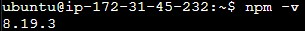

# Application Code Setup

*Create a new directory for your To-Do project*

`mkdir Todo`

*Verify the Todo directory*

`ls`

*Change to the Todo directory*

`cd Todo`

*Initialise your project with npm init*

`npm init`

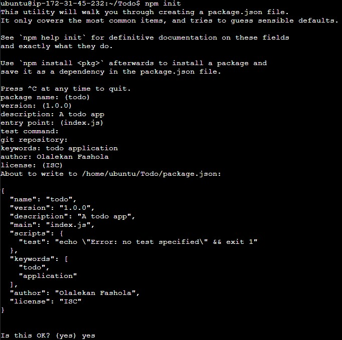

**Install ExpressJS**

*To use express, install it using npm:*

`npm install express`

*Now create a file index.js with the command below and confirm file creation*

`touch index.js`
`ls`

*Install the dotenv module*

`npm install dotenv`

*Open the index.js file with the command below*

`vim index.js`

*Type the code below into it and save. Do not get overwhelmed by the code you see. For now, simply paste the code into the file.*

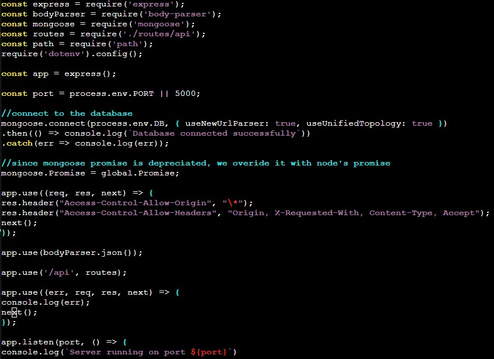

*Start the server to see if it works. Open your terminal in the same directory as your index.js file and type:*

`node index.js`

*Open port 5000 in EC2 Security Groups*

*Open up your browser and try to access your server’s Public IP or Public DNS name followed by port 5000:*

**Routes**

*There are three actions that our To-Do application needs to be able to do:*

-   Create a new task
-   Display list of all tasks
-   Delete a completed task*

*For each task, we need to create routes*

`mkdir routes`

*Change directory to routes folder*

`cd routes`

*Open the file with the command below*

`vim api.js`

**Models**
*Change directory back Todo folder with cd .. and install Mongoose*

`npm install mongoose`

*Create a new folder models and change directory to models*

`mkdir models`
`cd models`

*Inside the models folder, create a file and name it todo.js*

`touch todo.js`

*Open the file created with vim todo.js then paste the code below in the file*

`vim todo.js`

*Update our routes from the file api.js in ‘routes’ directory*

`vim api.js`
`%d`

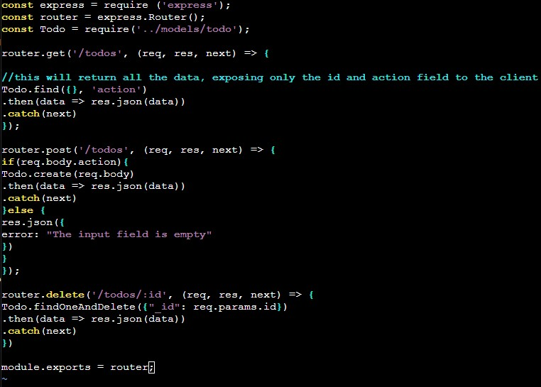

**MongoDB Database**

*Create Mongodb*

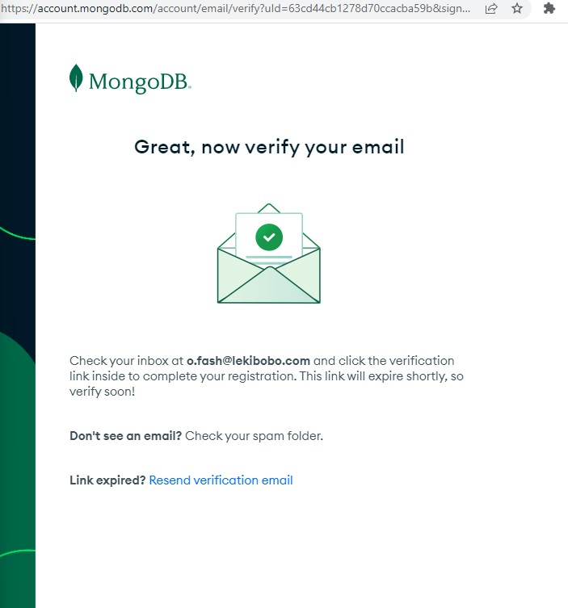

*Allow access to mongodb from anywhere*

*Create mongodb database*

*Create a file in your Todo directory and name it .env*

`vim todo.js`

*Add the connection string to access the database in it, just as below*

`DB = 'mongodb+srv://<username>:<password>@<network-address>/<dbname>?retryWrites=true&w=majority'`

*Update the index.js to reflect the use of .env, delete the paste the entire content*

`vim index.js`
`%d`

*Start your server using the command*

`node index.js`

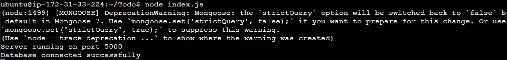

*Open your Postman, create a POST request to the API*

`http://<PublicIP-or-PublicDNS>:5000/api/todos`

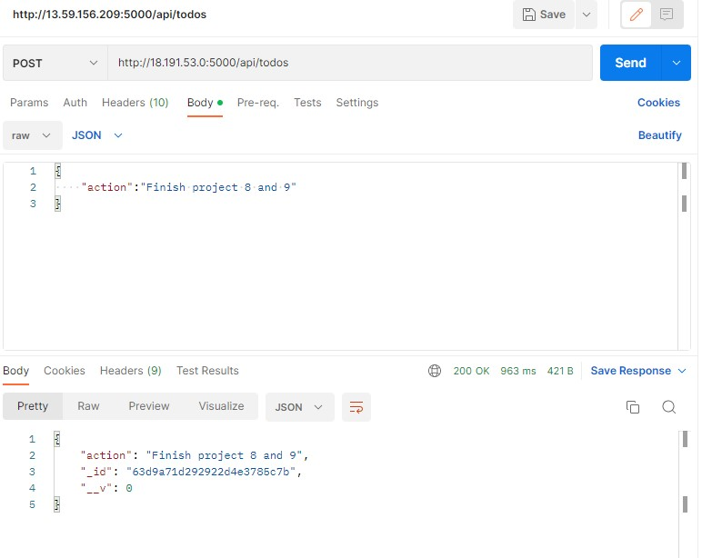

*Create a GET request to your API*

`http://<PublicIP-or-PublicDNS>:5000/api/todos`

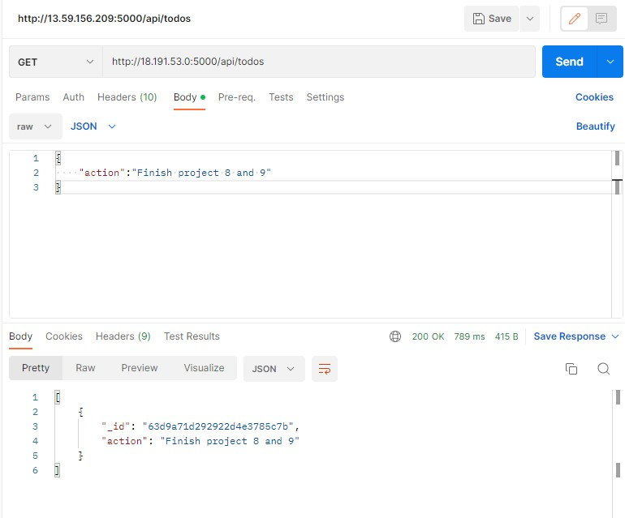

**Step 2 – Frontend creation**

*Create react app in the Todo directory*

`npx create-react-app client`

**Running a React App**

*Before testing the react app, there are some dependencies that need to be installed.*

`npm install concurrently --save-dev`

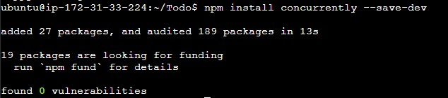

*Install nodemon. It is used to run and monitor the server*

`npm install nodemon --save-dev`

*Open the package.json file in the Todo directory, then paste the code*

`vim package.json`

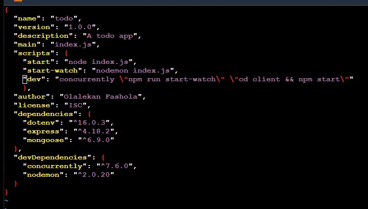

*Configure Proxy in package.json, change directory to client*

`cd client`
`vi package.json`

*Add the key value pair in the package.json file "proxy": "http://localhost:5000"*

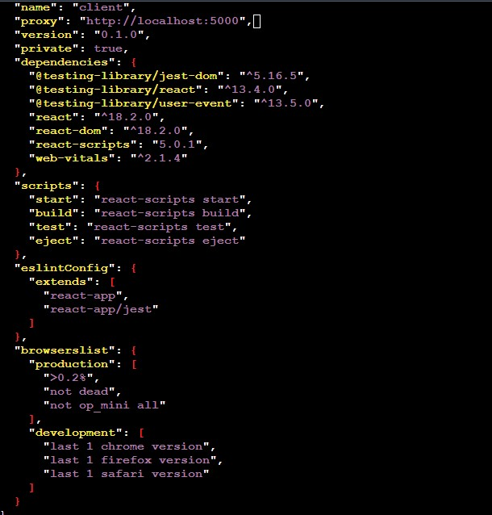

*Inside the Todo directory, run the command below*

`npm run dev`

**Creating your React Components**

*From your Todo directory run*
*move to the src directory*
*Inside your src folder create another folder called components*
*Move into the components directory*
*Inside ‘components’ directory create three files Input.js, ListTodo.js and Todo.js*
*Open Input.js file*
*Move to the src folder*
*Move to clients folder*

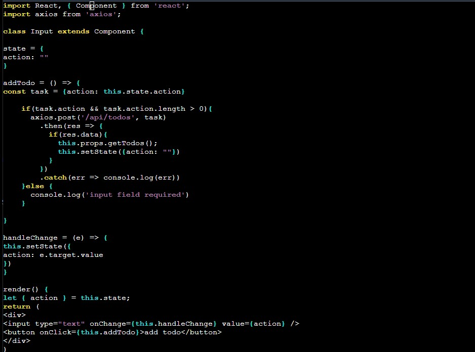

*Install axios*

`npm install axios`

*Install axios*

*Go to ‘components’ directory*

`cd src/components`

*open your ListTodo.js*

`vi ListTodo.js`

*Move to the src folder*

`cd ..`

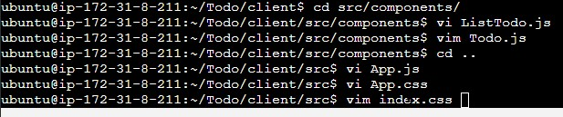

*Open App.js*

`vi App.js`

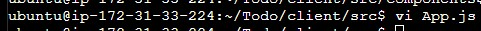

*Copy and paste the code below into it*

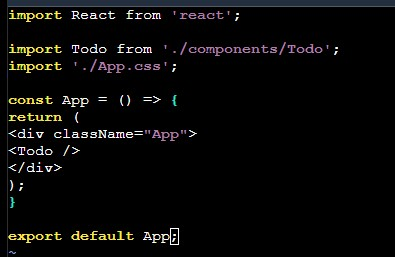

*Open App.css*

`vi App.css`

*Open index.css and paste*

`vim index.css`

*Go to the Todo directory*

`cd ../..`

`npm run dev`

